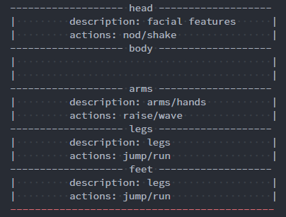

# Greymon

tiny pluggable frontend architecture

---

## Initial blueprint

greymon is composed of 5 parts:

- head has facial features and can nod or shake

- body

- arms have hands and can raise or wave

- legs can jump or run

- feet

All those parts need to init with descriptions, and those actions can defined by yourself.

## TODO: How to use

## TODO: How it works